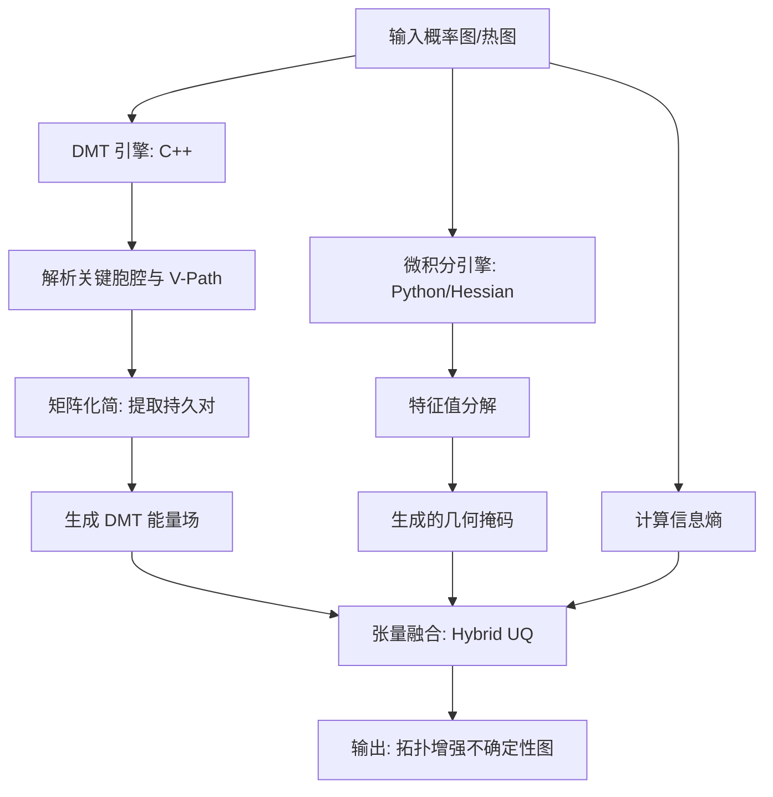

# Morse 3D & HL-PH 数学逻辑与算法白皮书

本导引旨在深入阐述系统核心——**离散莫尔斯理论 (Discrete Morse Theory, DMT)** 与 **Hessian 局域化持久同调 (Hessian-Localized Persistent Homology, HL-PH)** 的数学构造与工程实现逻辑。

---

## 一、 离散莫尔斯理论 (Discrete Morse Theory, DMT)

系统的核心拓扑分析引擎 `morse_3d` 基于 Robin Forman 提出的离散莫尔斯理论。

### 1.1 胞腔复形 (Cubical Complex) 构造
为了在离散体素网格上定义拓扑，我们将 $N \times M \times L$ 的图像 $I$ 嵌入到一个双倍尺寸的胞腔复形 $K$ 中：
- **0-cells (顶点)**: $v = (2i, 2j, 2k)$
- **1-cells (棱)**: 连接相邻顶点的线段
- **2-cells (面)**: 由四条棱围成的平面单元
- **3-cells (体)**: 由六个面围成的体积单元

每个胞腔 $\sigma$ 的标量值 $f(\sigma)$ 取其关联体素的最大概率值（Lower-star Filtration）。

### 1.2 离散梯度向量场 (Discrete Gradient Field)
通过建立胞腔之间的配对关系 $(p, q)$，其中 $\text{dim}(q) = \text{dim}(p) + 1$，构建离散向量场 $V$。
- **配对准则**：若 $\sigma^d < \tau^{d+1}$ 且满足特定正则性，则称两者形成一个**梯度向量**。
- **关键胞腔 (Critical Cells)**：在 $V$ 中无法找到配对的胞腔。
    - **Index 0**: 局部极大值 (对应连通分量/团块)。
    - **Index 1**: 一阶鞍点 (连接团块的“桥梁”)。
    - **Index 2**: 二阶鞍点 (包围空洞的“围城”)。
    - **Index 3**: 局部极小值 (空洞核心)。

### 1.3 莫尔斯-斯梅尔复形与化简 (Morse-Smale Complex)
系统不直接在原始网格上计算，而是构建压缩的莫尔斯边界矩阵 $\partial^M$：
1. **V-Path 追踪**：利用带记忆的 DFS 搜索关键胞腔之间的离散流线。
2. **边界映射**：$\partial^M(\sigma_i^d) = \sum \langle \partial \sigma_i^d, \sigma_j^{d-1} \rangle \sigma_j^{d-1}$，其中 $\langle \cdot \rangle$ 为经过 V-Path 的代数跳转次数（在 $\mathbb{Z}_2$ 系下简化为奇偶性）。
3. **矩阵化简**：使用标准持久同调化简算法，得出持久对 $(b, d)$。

---

## 二、 HL-PH (Hessian-Localized Persistent Homology)

HL-PH 是本系统提出的创新性拓扑不确定性量化 (UQ) 框架，解决了传统 PH 空间分布离散化、难以与深度学习端到端结合的问题。

### 2.1 物理意义：从“代数点”到“几何场”
PH 返回的是一组无权重的 $(b, d)$ 坐标点。HL-PH 的核心目标是将其权重化并反射回图像坐标系，形成连续的**拓扑不确定性场**。

### 2.2 组件一：DMT 能量力场 ($U_{DMT}$)
我们在拓扑变化最剧烈的“出生点” (Birth) 和“死亡点” (Death) 注入能量：
$$U_{DMT}(x) = \max_{i} \{ \text{persistence}_i \cdot K(x - x_i) \}$$
其中 $K$ 是由系统实现的复合算子：
1. **核函数构成**：$K = \text{Gaussian}(\text{Box}_{15 \times 15 \times 15})$。
2. **算法实现**：首先通过 `maximum_filter(size=15)` 将离散点的势能扩散至周围 15 像素半径，随后配合 `gaussian_filter(sigma=1.0)` 进行各向同性平滑，以消除硬边缘并模拟拓扑影响的连续衰减。

### 2.3 组件二：Hessian 几何手术刀 ($G_{Hessian}$)
为了精确定位血管中心线或鞍点区域，我们引入微分几何约束。对于 3D 图像 $f$，计算 Hessian 矩阵 $H(f)$ 的特征值 $\lambda_1 \ge \lambda_2 \ge \lambda_3$：
- **鞍点判别式**：$\mathcal{S} = \{x \mid \lambda_1(x) > 0 \text{ 且 } \lambda_2(x) < 0 \text{ 且 } \lambda_3(x) < 0\}$
- **得分函数**：$G_{Hessian} = \lambda_1 \cdot \mathbb{1}_{\mathcal{S}}$
此步骤能过滤掉非管态的噪声，仅保留具有马鞍面几何特性的区域。

### 2.4 组件三：动态张量融合 (Tensor Fusion)
最终的拓扑不确定性图 $UQ_{HL-PH}$ 由三项乘积构成：
$$UQ_{HL-PH} = \underbrace{U_{DMT}}_{\text{代数全局视野}} \times \underbrace{G_{Hessian}}_{\text{微分局部约束}} \times \underbrace{\text{Entropy}^{\gamma}}_{\text{概率分布扰动}}$$

- **Entropy (熵)**：测量模型对分类的基本犹豫度。
- **$\gamma$ (锐化系数)**：通过指数变换增强高动态范围。

---

## 三、 演算法工作流 (Workflow)

---

> [!TIP]
> **为什么要进行这种混合？**
> 单纯的 PH 只有拓扑信息，丢失了局部解剖形态；单纯的 Hessian 会产生大量几何假阳性。HL-PH 通过 PH 提供“全局导航”，通过 Hessian 提供“局部对准”，从而在医学影像（如血管分割）中实现极高精度的解剖一致性约束。
